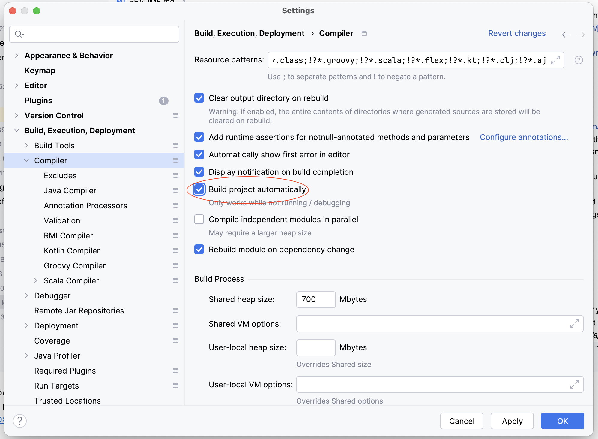

# Exercise Goal and Scope
Learn the basics of Java by replacing a TypeScript application by a Java application.
This assignment takes 8 to 16 hours and is made for students who know typeScript.

# Project introduction
This is a simple text based adventure game.
It has a backend, see _typescript/api_ and a frontend, see _typescript/web_.
Both are written in TypeScript.
The game story is only a sample, you should go to the next room by finding the key (and do not open the wrong box).
There is also Java backend application. It uses maven and Spring boot. But the Java application is not yet finished.

# Exercise
We want to replace the TypeScript backend with a Java backend.
In the current setup there is already a small Java application, but it is not complete yet.
We want it to behave exactly the same as the TypeScript backend.
You should do this by copying the code from the TypeScript backend to the Java backend and adjust it in such a manner that it compiles, starts en behaves the same as in the typescript backend.

# Prerequisites
## You most likely already have installed
- We recommend that you use the most recent Long Term Support (LTS) version. For Java that is version 21.03 and for Node that is version 20.15.1.
- Install Java (most likely you already have done this)
  - Use JDK 21.03, see https://www.oracle.com/java/technologies/downloads/
- Install Node
  - Use v20.15.1, see https://nodejs.org/en/download/package-manager

## It is advised to install
- Maven https://maven.apache.org/install.html
- IntelliJ Ultimate Edition https://www.jetbrains.com/student
  - A very handy and powerfull IDE (especially the Ultimate edition). 
  - You can apply for a educational license when you register yourself using your HvA email address and apply for a educational licence
  - Once downloaded and installed, check if you have the following plugins installed and enabled
    - Spring, Spring boot, Spring web
  - Under Settings / Build, ../Compiler set "Build automatically" to true (this saves you time clicking on build every time you made changes to your code)



# Setting up the project
- Open the root folder in IntelliJ (or another IDE of your choice)
- Right click on _typescript/package.json_ and select "Run install"
- To start the typescript backend, open _typescript/api/package.json_ and run _dev:api_. Or in a terminal go into the typescript _directory/api_ and run ```npm run dev:api```
- To start the frontend open _typescript/web/package.json_ and run _dev:web_. Or in a terminal go into the _typescript/web_ directory and run ```npm run dev:api```
- **Note**!!! you can not run the typescript backend and the Java backend at the same time!!
- To run the Java application you first have to ricght-click on the file _java/api/pom.xml_ and select _Add as Maven Project_
- On order to run the Java application go to _java/api/src/main/java/game.engine.java.api.ApiApplication_ and select run, after right-clicking on the file

# Trouble-shooting
- **The java files are not working.**
  - **right click _java/api/pom.xml_ en select "Add as Maven Project"**

# Hints / steps to get you started
- First, set up the project, explore the project, run it (with typescript backend) and play the game.
  - Test the typeScript backend with a REST client like postman
    - Hint: The endpoints are in a file called _routes.ts_
- Start the project with the java backend.
  - Test the Java backend with a REST client like postman
    -  Hint: The endpoints are in a class called _GameController_, which can be found in a file called _GameController.java_
- There are already some classes moved to the Java application
  - Not all attributes and methods have been moved to the java application.
  - See the TODOs in the java files and fix them all!
- Add the missing rooms and objects
- Add your own story line
- Complete extra challenges

# Extra technical challenges
The below technical challenge do not need to be picked up in the listed order.
Choose the ones you think are interesting and match your skills.

## Add more rooms and object to the story (level 1)
- Currently, there are only 3 rooms. We want more.

## Show inventory to user (level 1)
- Currently, the inventory (see _PlayerSession_ class) is not shown to the user.
- We want to show the inventory to the user.
- Steps to perform
  1. Add inventory to the _GameStateResponse_ class
  2. Set the new inventory field in _ResponseBuilder.fillResponse()_ method
  3. Update _SmallAdventureCanvas_ to make it display to inventory

## Track / save important events (level 1)
- Currently, we do not know which important actions the user has done in the past.
- For example, we do not know if the user has talked to specific character.
- This information can be used to determine to outcome of certain actions.
- For example, the first time a user talks to a character the character introduces him / her self, the second time the character gives a hint.
- Implementation hints:
  - The functionality should be similar to the inventory functionality.
  - Except that it does not need to be returned to the user.
  - Therefore, it does not need to be added to the _GameStateResponse_ object.

## Make sessions persistent (level 2)
- Currently, when the backend is restarted, all session data is gone.
- To prevent this we want to save and retrieve all session data to a file or to a database.

## Only show action that make sense to the object (level 3)
- Currently, all items have the same actions (open, smell, move, talk to)
- This is because alle items extend _GameObject_
- We want each item to have only those specific actions that make sense.
  - For example talk to sould only be available on characters and open only to boxes and doors.
- Steps to perform
  1. Create an interface for each action (open, smell, move, talk to)
  2. Each interface should only have one method.
  3. Remove the methods (_open_, _smell_, _move_, _talkTo_) from _GameObject_.
  4. Each item should implement the interfaces that make sense.
  5. _GameObject_ should have abstract method called _availableActions_ that returns a list with strings, indicating which actions are available.
  6. Each _Item_ should implement the _availableActions_ method, thereby indicating which actions are available
  7. Add an attribute of type array of strings called _availableActions_ to _GameEntityResponse_ and make sure it is set in _ResponseBuilder_
  8. In the front-end print the actions dynamically based on the availableActions.

## Implement other scenarios (level 4)
- Currently, the place to interact is a room.
- We want more, for example a battle or a conversation
- Steps to perform
  1. Create, with your team, a UML class and/or sequence diagram on how you want to implement this.
  2. Contact a teacher to review the UML class and/or sequence diagram in an expert meeting (with your team and the teacher)
  3. Implement the UML diagrams
